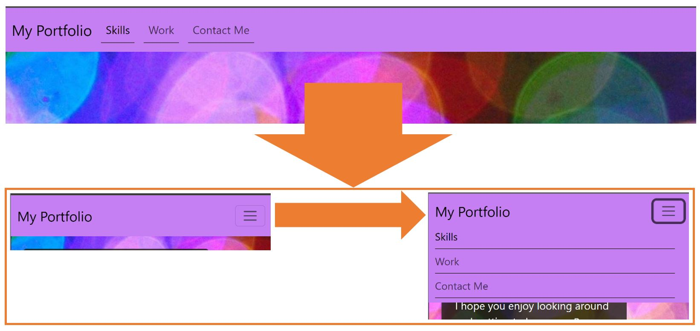
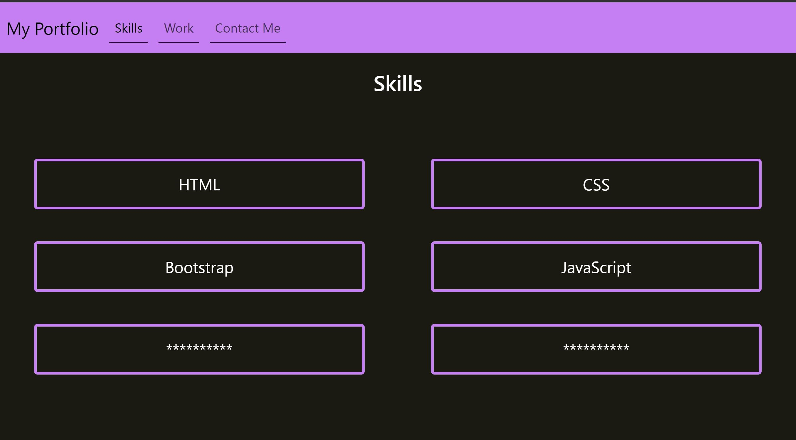
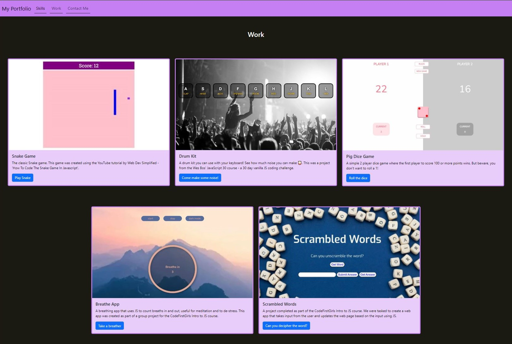

# E-Davies Bootstrap Portfolio

## Description

I wanted to re-create my portfolio webpage using Bootstrap to showcase my work and skills to employer who are looking to hire. 

This has been achieved by:
* Using Bootstrap components to create a functional and responsive webpage
* Replacing my navbar with a Bootstrap component that responsively creates a dropdown menu on smaller screens:

 

* Using Bootstrap Grid to showcase my skills

* Using Bootstrap Cards and Grid to showcase my work

## Installation

Please use the following link to access the website: https://e-davies.github.io/Bootstrap-Portfolio/

## Usage

This website will be used by employers looking to hire and allow them to discover my ability and skills as a front-end developer.

## Skills used in this project

